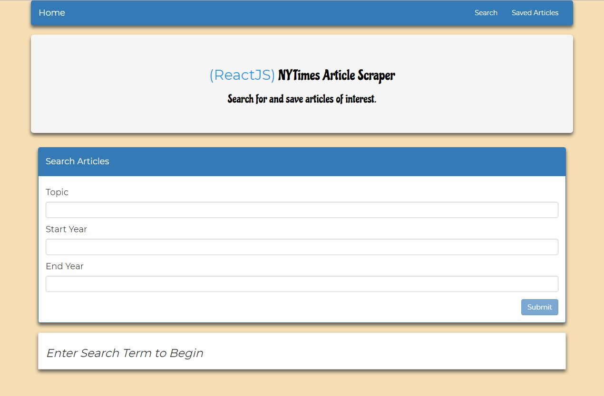
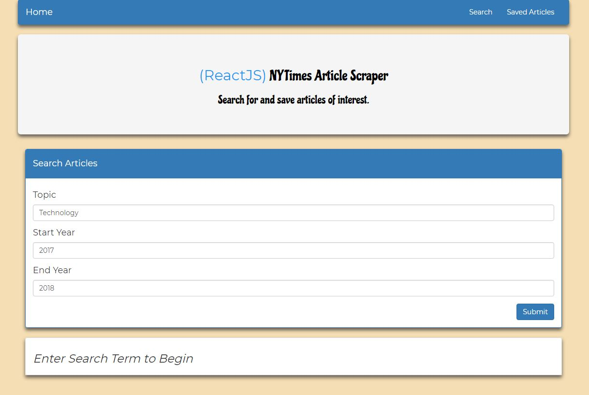
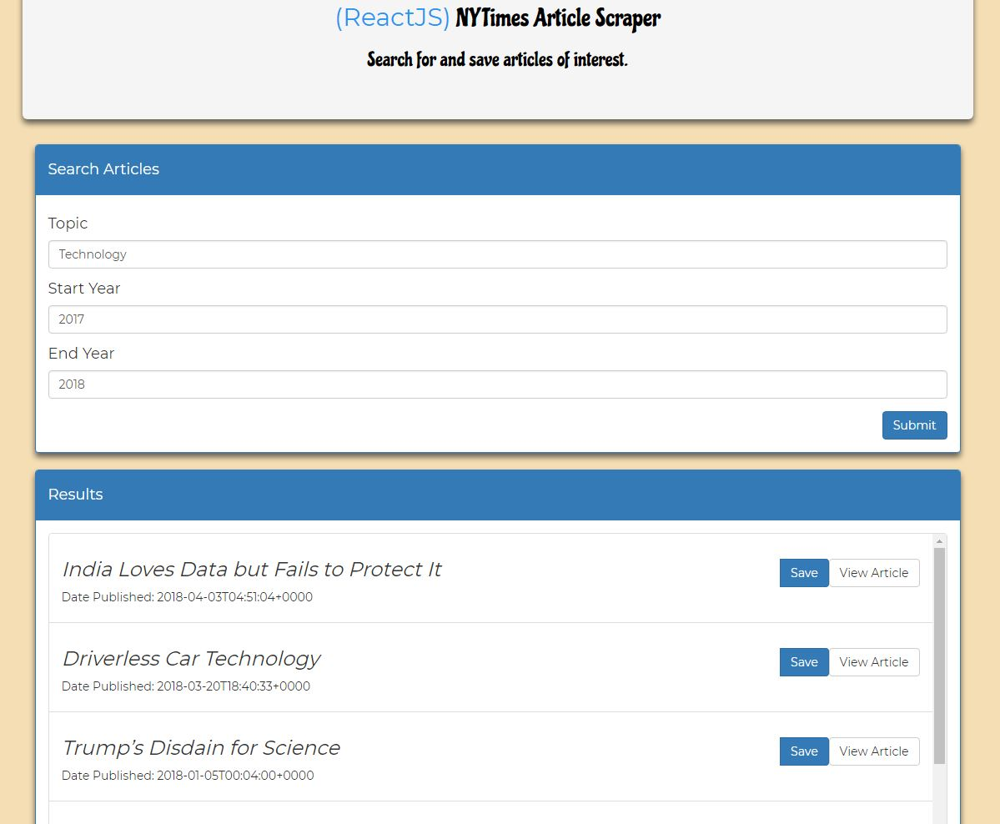
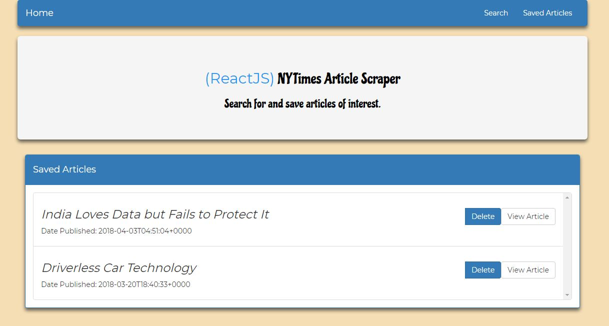
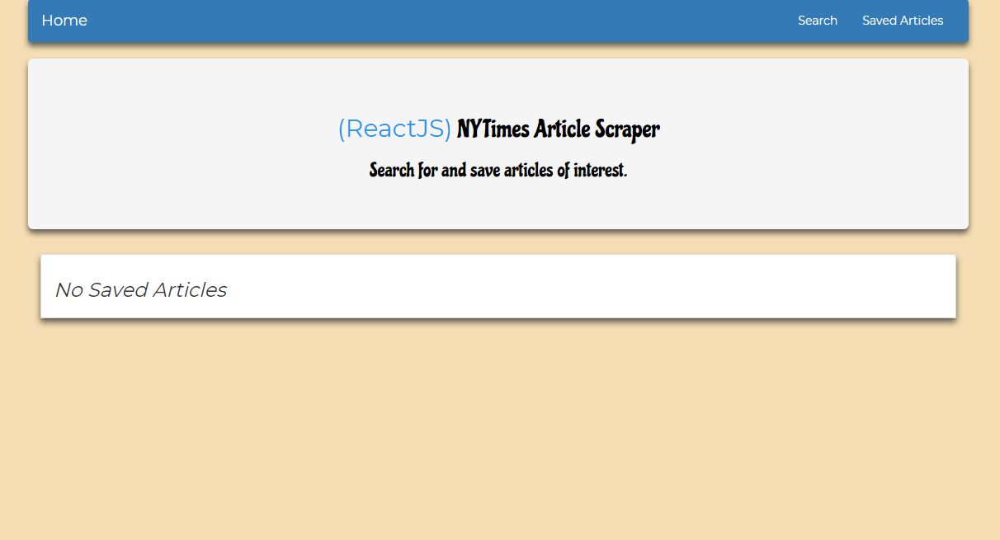

# MERN Stack-Scraper

## Description

This app consisted on creating React components, and utilize the React mounting lifecycle to query and display articles based on User Searches. I also used Node, Express and MongoDB so that users can save articles to read later. Making this single page application a 2 part built (Front-End & Back-End).

* As shown below, the User is greeted with a easy to use UI.

* Then, the User is able to fill the form fields up with a topic and year range. Keep in mind, that if the User tries to click on the Submit button before entering data on the input fields the app will not allow it to submit.  

* Then, after filling the form correctly the app will display the articles associated to his/her query.  At this point, the User can view the article or save it to read later.

* If the User wants to access his/her saved articles, he/she can easily see them by clicking on "Saved Articles" and they will be loaded from the MongoDB database

*To conclude, once the User has finished reading the articles. He/She can delete the article by clicking on the "Delete" button.

## Demo

The demo of this application can be found [here]().

## Installation

To run the application locally, first clone this repository with the following command.

	git clone https://github.com/miguelaw/MERN-Stack-Scraper.git
	
Access to the project's folder

	cd MERN-Stack-Scraper

Next, install the application dependencies in main folder & inside client folder.

	yarn install

Next, start your Mongo Service.

    mongod
    mongo
	
Finally, run the app locally in the main folder (MERN-Stack-Scraper).

	npm run client & node server.js

	
Now, open the local application on port 3000 at the URL: `http://localhost:3000/`.

**Thank you for checking out our work!**
